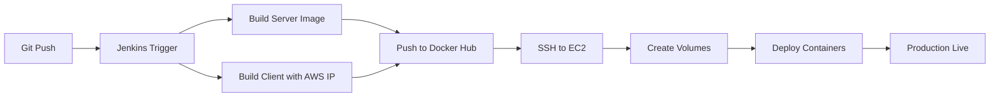

# Production-Grade Deployment Architecture

## 🏗️ Architecture Overview

This project follows **environment-agnostic deployment principles** with zero hardcoded configurations.

---

## 📋 Environment Configuration

### **Local Development**
```bash
# client/.env
VITE_API_URL=http://localhost:5000/api

# Run locally
docker-compose up
```

### **AWS Production**
```bash
# Jenkinsfile builds with build-arg
docker build --build-arg VITE_API_URL=http://16.171.153.33:5000/api -t client

# Server receives BASE_URL via environment
docker run -e BASE_URL="http://16.171.153.33:5000" lotus-server
```

---

## 🔧 Technical Implementation

### **1. Frontend Environment Logic**
✅ **No hardcoded IPs** - All API calls use `import.meta.env.VITE_API_URL`

**Files using environment variables:**
- `client/src/services/apiClient.js`
- `client/src/api/apiClient.js`
- `client/src/utils/formatters.js`
- `client/src/components/Avatar.jsx`

**Build-time Configuration:**
```dockerfile
# client/Dockerfile
ARG VITE_API_URL
ENV VITE_API_URL=$VITE_API_URL
RUN npm run build  # Vite injects env at build time
```

---

### **2. Backend CORS Configuration**
✅ **Dynamic origin validation** with production/development modes

**Configuration Logic:**
```javascript
// server/config/security.js
origin: (origin, callback) => {
  const allowedOrigins = [
    'http://localhost:3000',
    'http://localhost:5173',
    'http://16.171.153.33',
    'http://16.171.153.33:80'
  ];
  
  if (allowedOrigins.includes(origin)) {
    callback(null, true);
  } else {
    // Allow in dev, reject in production
    callback(null, process.env.NODE_ENV !== 'production');
  }
}
```

**Critical Headers for Video Streaming:**
```javascript
// Applied to /video/* and /uploads/*
'Access-Control-Allow-Origin': '*'
'Access-Control-Allow-Headers': 'Range, Content-Type'
'Access-Control-Expose-Headers': 'Content-Range, Accept-Ranges, Content-Length'
```

---

### **3. Shaka Player Fix**
✅ **Updated to v5.0 compliant syntax**

**Before (Deprecated):**
```javascript
const player = new shaka.Player(videoElement);
```

**After (v5.0 Compliant):**
```javascript
const player = new shaka.Player();
await player.attach(videoElement);
```

---

### **4. Persistent Storage**
✅ **Volume mounts for upload persistence**

**Jenkinsfile Configuration:**
```bash
mkdir -p ~/lotus-uploads/videos ~/lotus-uploads/thumbnails ~/lotus-uploads/avatars

docker run -v ~/lotus-uploads:/app/uploads lotus-server
```

**Benefits:**
- Survives container restarts
- Shared across deployments
- Host filesystem backup capability

---

## 🚀 Deployment Pipeline

### **Jenkins CI/CD Flow**



### **Stage 1: Build & Push**
```groovy
docker build -t lotus-server ./server
docker build --build-arg VITE_API_URL=http://16.171.153.33:5000/api -t lotus-client ./client
docker push lotus-server
docker push lotus-client
```

### **Stage 2: Deploy to AWS**
```groovy
ssh ubuntu@16.171.153.33 '
  mkdir -p ~/lotus-uploads
  
  docker run -d \
    --name lotus-server \
    -v ~/lotus-uploads:/app/uploads \
    -e BASE_URL="http://16.171.153.33:5000" \
    -e MONGODB_URI="..." \
    -p 5000:5000 \
    lotus-server
    
  docker run -d \
    --name lotus-client \
    -p 80:80 \
    lotus-client
'
```

---

## ✅ Resolved Issues

| Issue | Root Cause | Solution |
|-------|-----------|----------|
| **Video 404** | Lazy route loading bug | Eager loading in routes.js |
| **CORS blocked videos** | Missing Range headers | Explicit CORS for /video/* |
| **Thumbnails fail** | No CORS on static files | Middleware CORS for /uploads/* |
| **Uploads lost on restart** | Container filesystem | Host volume mount |
| **Shaka Player warning** | Deprecated constructor | Use attach() method |
| **Hardcoded IPs** | Direct URL references | Environment variables everywhere |

---

## 🔍 Testing Checklist

### **Local Development**
- [ ] `npm run dev` (client) - Uses localhost:5000
- [ ] `docker-compose up` - Full stack local
- [ ] Video playback works
- [ ] Thumbnails load
- [ ] Registration/login works

### **AWS Production**
- [ ] Jenkins build completes
- [ ] Frontend accessible at http://16.171.153.33
- [ ] API responds at http://16.171.153.33:5000/api/videos
- [ ] Video streaming works (no CORS errors)
- [ ] Thumbnails display correctly
- [ ] Uploads persist after container restart

---

## 📚 Configuration Reference

### **Required Environment Variables**

**Server (Production):**
```bash
PORT=5000
BASE_URL=http://16.171.153.33:5000
MONGODB_URI=mongodb+srv://...
JWT_SECRET=...
NODE_ENV=production
```

**Client (Build Args):**
```bash
VITE_API_URL=http://16.171.153.33:5000/api
```

---

## 🎯 Best Practices Implemented

1. ✅ **12-Factor App Methodology** - Environment-based configuration
2. ✅ **Zero Hardcoded Values** - All IPs/URLs via environment
3. ✅ **Separation of Concerns** - Build-time vs runtime config
4. ✅ **Production Parity** - Same codebase, different env vars
5. ✅ **Stateless Containers** - Persistent data via volumes
6. ✅ **Security Hardening** - CORS validation, credentials handling
7. ✅ **Modern Standards** - Shaka Player v5.0 compliance

---

## 🔐 Security Notes

- CORS strictly validates origins in production
- Static file CORS (`*`) necessary for browser media playback
- Credentials: true enables cookies for authenticated requests
- Range headers exposed for video streaming (HTTP 206)

---

## 📞 Support

**Production URL:** http://16.171.153.33  
**API Endpoint:** http://16.171.153.33:5000  
**Jenkins:** http://localhost:8080 (via ngrok)

For issues, check:
1. Docker logs: `docker logs lotus-server`
2. Jenkins console output
3. Browser DevTools Network tab for CORS errors
